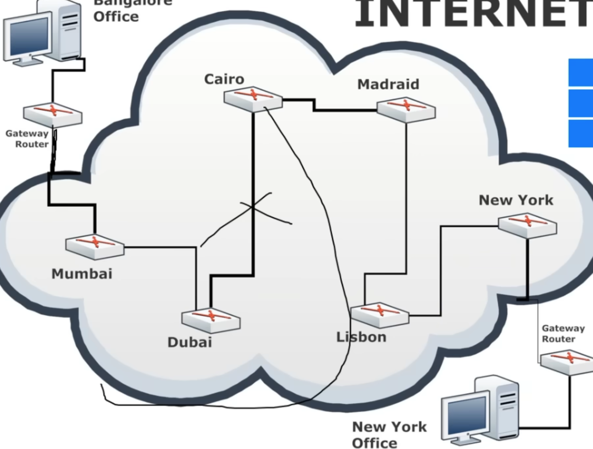
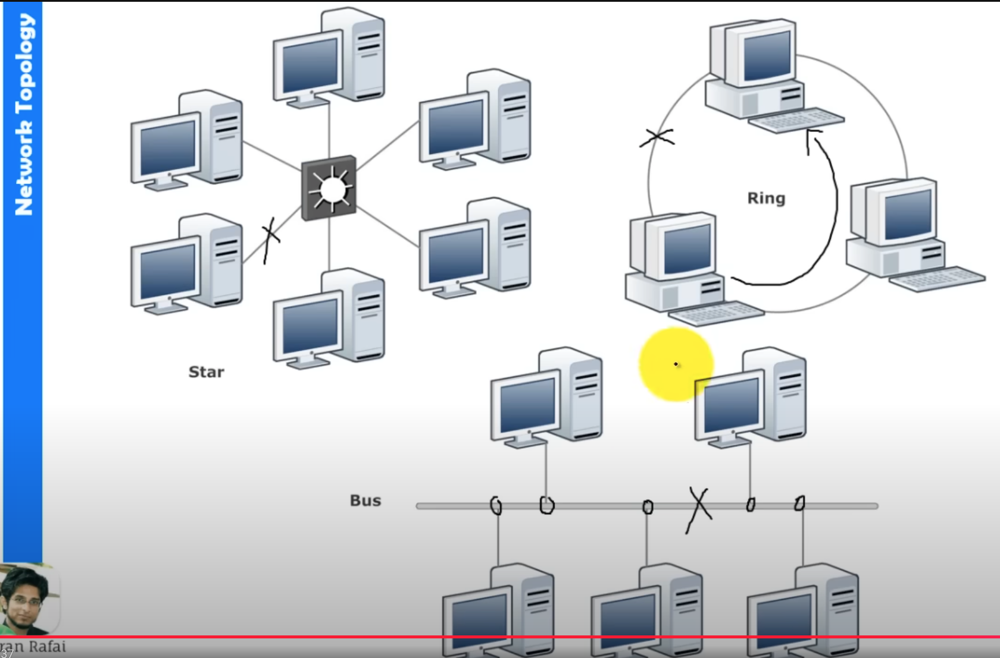
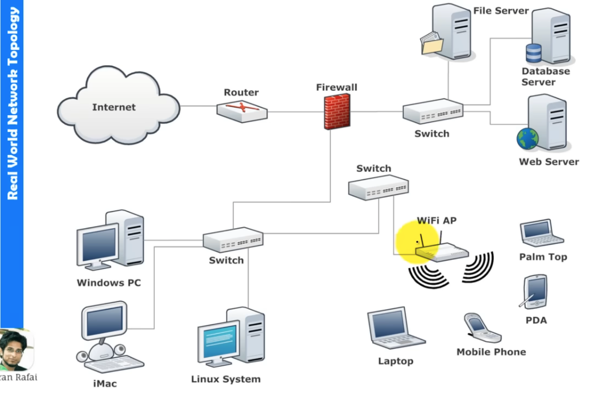

# what is Internet? 
So you can conneect to two other computers if you have two NIC , 3 Computers with 3 NIC so.....

with this Concpet led to a Resvolotionary Idea called "Ehternet":

LAN (Local Area Network): A high-speed network that connects a group of devices within a limited area, such as a home, office floor, or campus. LANs usually use switches, routers, or access points to connect devices, enabling communication and resource sharing (like files, printers, and internet access).

LAN's are Interconncted to each other to form a WAN - Wide area network 

These LAN's, VLAN's and PAN's are together combined to Foram Interconnections called "Internet".

## Speed of the Internet: 

### 🌐 Speed, Delay, and Availability

Speed:
        From Bangalore OFC (Optical Fiber Cable) to New York OFC, the speed of data transfer depends mainly on the link bandwidth you have.

Delay:
        Delay is the time taken for data to travel across the network, and it depends on the distance and the number of intermediate nodes (routers/switches) it passes through. Fewer nodes and shorter distance mean lower delay.

            Example: When you request a video from YouTube, if the server is located in New York, the data has to travel through many nodes, resulting in higher delay. But if YouTube has a Content Delivery Network (CDN) server near you, the data will be delivered with much less delay.

Availability:
            If the direct link between Bangalore and New York is unavailable, the network automatically looks for an alternative route. This backup route may be longer, which can affect performance, but ensures continued connectivity.

# Network Topology

## Ex: 

