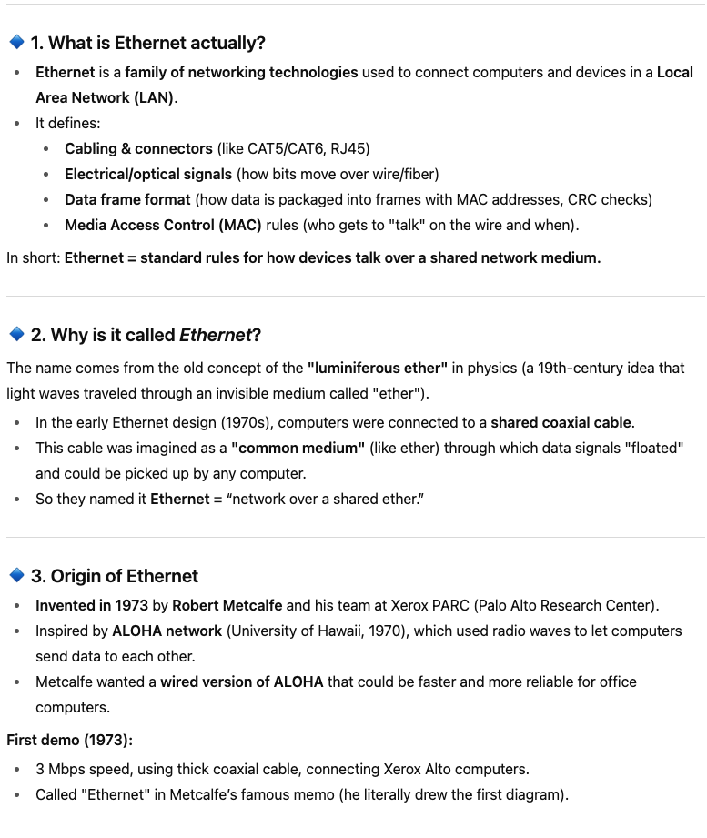

# what is Internet? 
So you can conneect to two other computers if you have two NIC , 3 Computers with 3 NIC so.....

with this Concpet led to a Resvolotionary Idea called "Ehternet":

LAN (Local Area Network): A high-speed network that connects a group of devices within a limited area, such as a home, office floor, or campus. LANs usually use switches, routers, or access points to connect devices, enabling communication and resource sharing (like files, printers, and internet access).

LAN's are Interconncted to each other to form a WAN - Wide area network 

## Speed of the Internet: 

### Speed Delay and Availability